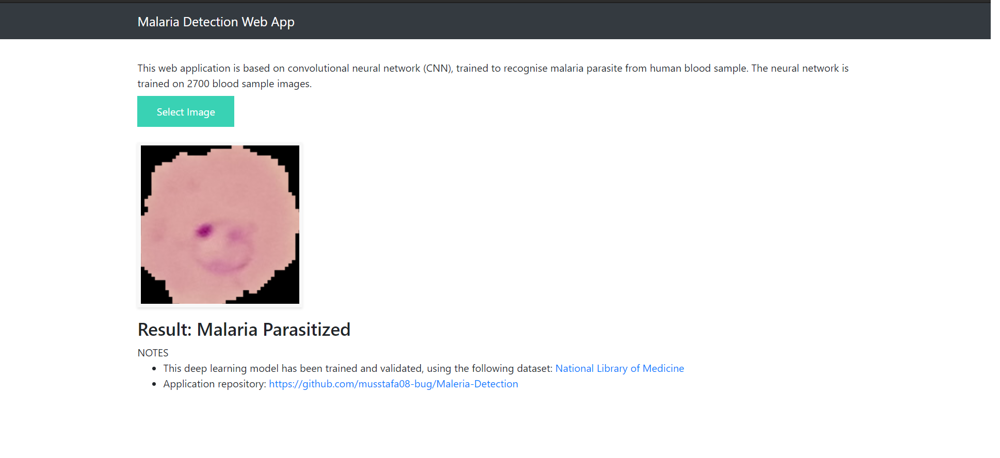
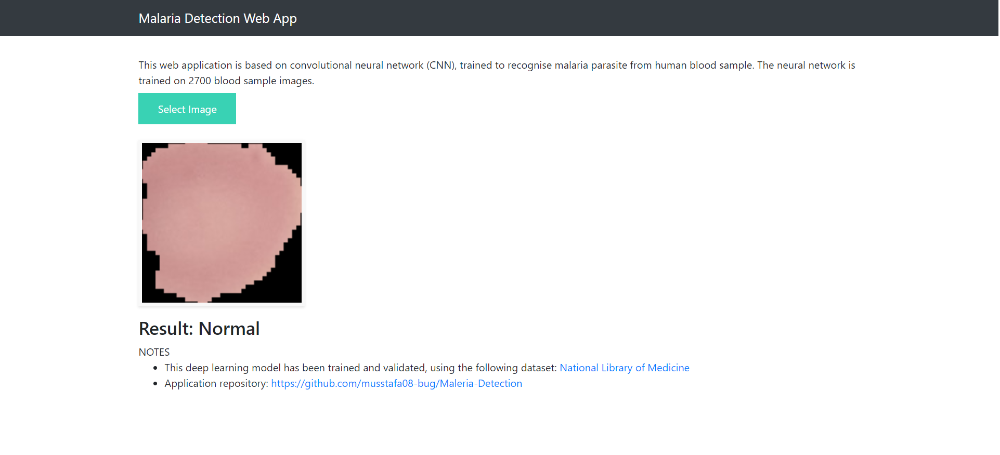

# Maleria-Detection Web App
This repository was created to classify Maleria Cells by using malaria parasite image dataset  <a href="https://ceb.nlm.nih.gov/repositories/malaria-datasets/">National Library of Medicine</a>. Currently it is not live because of the file size. Soon i'll deploy it on cloud and update the link of the web app

## Infected Cell

## Normal Cell 

